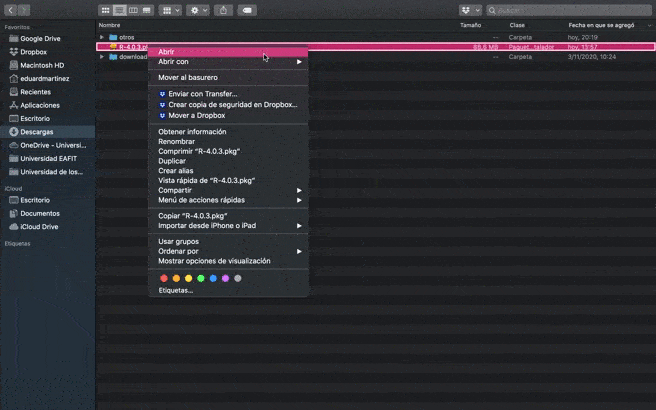

```{r setup, include=FALSE}
library(tidyverse)
options(htmltools.dir.version = FALSE)
library(knitr)
opts_chunk$set(
  fig.align="center",  
  fig.height=4, #fig.width=6, out.width="748px", out.length="520.75px",
  dpi=300, #fig.path='Figs/',
  cache=T#, echo=F, warning=F, message=F
  )
```

# Contenido

1. [Prólogo](#prologue)

2. [Syllabus](#syllabus)

3. [Usar R?](#use)

4. [Configuración inicial](#started) 
   
   4.1. [Instalar R y Rstudio](#install_R)
   
   4.2. [Instalar Git](#install_git)
   
   4.3. [Configurar Git](#c_git)

<!--------------------->
<!---    Prólogo    --->
<!--------------------->
---
class: inverse, center, middle
name: prologue

# Prólogo

<html><div style='float:left'></div><hr color='#FF007F' size=1px width=796px></html>


---

# Acerca del curso

* GitHub: [https://github.com/taller-R](https://github.com/taller-R)

* Slack: [https://slack.com](https://slack.com/intl/es-co/)

* Microsoft Teams: [Equipo de trabajo Taller de R, ECON-1302](https://www.microsoft.com/es-co/microsoft-teams/download-app)

--

# Acerca de mí

[Eduard Martinez](https://github.com/eduard-martinez), estudiante doctorado en Economía de la Universidad de los Andes. Puedes ver mi página web [aquí](https://eduard-martinez.github.io).

<p style="color:black"> ef.martinezg@uniandes.edu.co </img></p>

<p><a href="https://twitter.com/emartigo" style="color:black;">   @emartigo</a> </p>
 
<p><a href="https://github.com/eduard-martinez" style="color:black;">   eduard-martinez </a> </p>


<!--------------------->
<!---    Syllabus   --->
<!--------------------->
---
class: inverse, center, middle
name: syllabus

# Syllabus

<html><div style='float:left'></div><hr color='#FF007F' size=1px width=796px></html>

(Puedes encontrar el programa completo del curso [aquí](https://github.com/taller-R/taller-R/blob/master/ECON_1302_01_Eduard_Martinez.pdf))


---
# Objetivo 

Este curso busca promover el uso de lenguajes de programación de código abierto (open source), familiarizando al estudiante con el entorno de trabajo de R e introduciendo a los estudiantes en algunos métodos computacionales aplicados en la investigación económica.

--

# Organización del curso

El curso está dividido en 5 módulos así: [ECON-1302](https://github.com/taller-R)

--

# Evaluación

| Componente                          | Peso |
|:-|-:|
| Task 1 (Módulos 1, 2 y 3) | 30% |
| Task 2 (Módulo 4) | 30% |
| Task 3 (Módulos 5) | 30% |
| Participación activa en el curso: | 10% |


---
# Cuando completes este curso...

<div align="center">
</img>
</div>


<!--------------------->
<!---    Usar R?    --->
<!--------------------->
---
class: inverse, center, middle
name: use

# Usar R?
<html><div style='float:left'></div><hr color='#FF007F' size=1px width=796px></html>

R es un entorno de programacion libre que fue desarrollado en el año 1993 por Robert Gentleman y Ross Ihaka del Departamento de Estadística de la Universidad de Auckland.


---
# Por qué usar R y RStudio? (cont...)

### Ventajas

- Ideal para la ciencia de datos
  - Ver: [*The Impressive Growth of R*](https://stackoverflow.blog/2017/10/10/impressive-growth-r/), [*The Popularity of Data Science Software*](http://r4stats.com/articles/popularity/).

- Open-source (free!) 
  - Puedes descargarlo, instalarlo y usarlo sin ningun costo.
  - Colaboradores en la academia y en la industria.
  - Más de 17.000 librerías disponibles.

- Múltiples bases de datos
  - No necesitas usar `preserve`, `keep` u otras funciones. Puedes tener varias bases de datos abiertas al mismo tiempo en diferentes objetos.

---
# Por qué usar R y RStudio?

### Popularidad

```{R, eval = T , include=T , echo = F}
pop_df =  data.frame( lang = c("SQL", "Python", "R", "SAS", "Matlab", "SPSS", "Stata"),
                      n_jobs = c(107130, 66976, 48772, 25644, 11464, 3717, 1624),
                      free = c(T, T, T, F, F, F, F))

### Plot it
pop_df %>%  mutate(lang = lang %>% factor(ordered = T)) %>%
            ggplot(aes(x = lang, y = n_jobs, fill = free)) +
            geom_col() + geom_hline(yintercept = 0) +
            aes(x = reorder(lang, -n_jobs), fill = reorder(free, -free)) +
            xlab("Statistical language") + scale_y_continuous(label = scales::comma) +
            ylab("Number of jobs") +
            labs( title = "Comparing statistical languages", subtitle = "Number of job postings on Indeed.com, 2019/01/06" , caption = "Tomado de: https://github.com/uo-ec607") +
            scale_fill_manual( "Free?", labels = c("True", "False"), values = c("#f92672", "darkslategray")) + 
            ggthemes::theme_pander(base_size = 17) + theme(legend.position = "bottom") 
```


---
## Además en R...

### Lenguaje orientado a objetos 

1. Todo es un objeto.

2. Todo tiene un nombre.

- pronto entenderemos mejor esto...

### Librerías y funciones

3. Se usan funciones para crear y editar objetos.

4. Todas las funciones han sido escritas anteriormente por otros colaboradores en paquetes o librerías que debemos "llamar" cada vez que se vayan a usar.


<!--------------------->
<!--- Configuración --->
<!--------------------->
---
class: inverse, center, middle
name: started

# Configuración inicial

<html><div style='float:left'></div><hr color='#FF007F' size=1px width=796px></html>

---
# Descargar softwares

- Descargar [R](https://cran.r-project.org/)

- Descargar [RStudio](https://www.rstudio.com/products/rstudio/download/preview/)

  - RStudio es un entorno de desarrollo integrado (IDE) para el lenguaje de programación R. En un lenguaje más practico, Rstudio brinda una interfaz más amigable que R, brindando una experiencia de aprendizaje más placentera.

- Descargar [Git](https://git-scm.com/downloads)

- Crear una cuenta de [GitHub](https://github.com/join?ref_cta=Sign+up&ref_loc=header+logged+out&ref_page=%2F&source=header-home)

- Configurar [Git](https://eduard-martinez.github.io/blog/github/clonar_github.html)

---
## Instalar R (cont...)

Version 4.0.3. para [MAC](https://cran.r-project.org/bin/macosx/)



---
## Instalar R (cont...)

Version 4.0.3. para [Windows](https://cran.r-project.org/bin/windows/base/) o [Linux](https://cran.r-project.org)


---
name: git
## Configurar Git

Ir a la CMD o terminal de su equipo y ejecutar los siguientes comandos:

```{bash eval=FALSE}
git config --global user.name 'Escribe tu usuario de GitHub'
```


```{bash eval=FALSE}
git config --global user.email 'Escribe tu correo de GitHub'
```


```{bash eval=FALSE}
git config --global user.password "Escribe tu contraseña de GitHub"
```

---
#  Checklist

☑ Instalamos R

☑ Instalamos RStudio

☑ Instalamos Git

☑ Configuramos nuestra cuenta de GitHub en nuestro equipo

---
class: inverse, center, middle

# Gracias
<html><div style='float:left'></div><hr color='#FF007F' size=1px width=796px></html>

